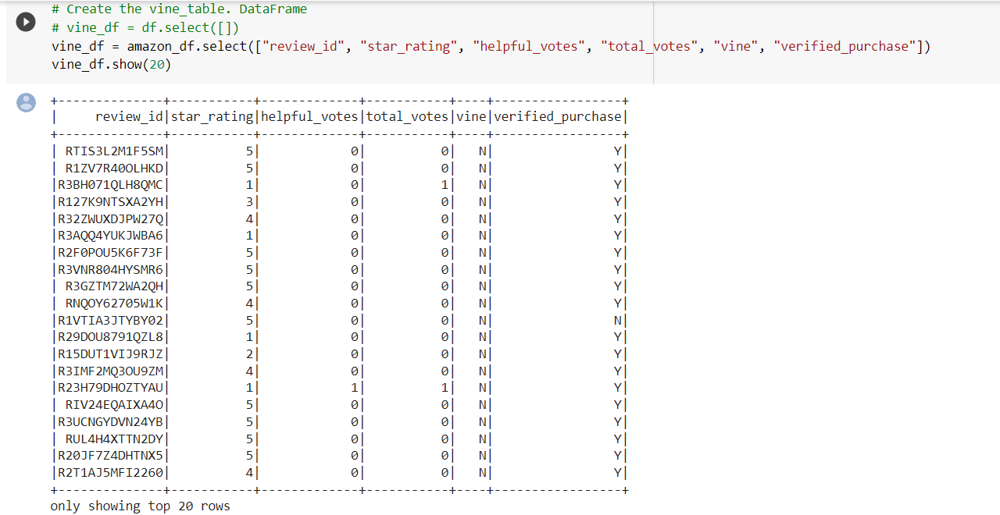

# Amazon_Vine_Analysis

## Overview
  There are approximately 50 datasets and each one contains reviews of a specific product, from clothing apparel to wireless products. We will use on of the dataset and 
use PySpark to perform the ETL process to extract the dataset, transform the data, connect to an AWS RDS instance, and load the transformed data into pgAdmin. Next, you’ll use PySpark to determine if there is any bias toward favorable reviews from Vine members in your dataset. 

## Results
Deliverable 1
1-Pick a dataset from Amazon review dataset and extract the same into a dataframe
2-Transfor the dataframe into four separate Dataframes that match the table schema in pgAdmin
3-Upload transformed data into the appropriate tables and run queries in pgAdmin to confirm that data has been uploaded
 

Deliverable 2

1-Method Used- Using PySpark
2-The data is filtered to create a DataFrame or table where there are 20 or more total votes 
3-The data is filtered to create a DataFrame or table where the percentage of helpful_votes is equal to or greater than 50% 
4-The data is filtered to create a DataFrame or table where there is a Vine review  
5-The data is filtered to create a DataFrame or table where there isn’t a Vine review  
6-The total number of reviews, the number of 5-star reviews, and the percentage 5-star reviews are calculated for all Vine and non-Vine reviews  

 

 

 

 

 
 
 

 

Questions:

How many Vine reviews and non-Vine reviews were there?
question1a.PNG
question1b.PNG

 

 

There were total of 94 paid reviews and 40,471 count of unpaid reviews

How many Vine reviews were 5 stars? How many non-Vine reviews were 5 stars?

 

 

There were total of 48 paid reviews with 5 stars and 15,663 count of unpaid reviews with 5 stars

What percentage of Vine reviews were 5 stars? What percentage of non-Vine reviews were 5 stars?

 

 

51% of paid vine reviews were 5 stars and for unpaid vine reviews it was 39%

## Summary

 

 

Total reviews were 40,565 and of that 15,711 were 5 starts which makes it upto 39 percent. Based on the results, there seems to be no positivity bias for the Vine program at all. 
On furthur classification it can be seen that 51% of paid vine reviews were 5 stars and for unpaid vine reviews it was 39%. This shows that there was positive bias in the vine program.

Additional data attribute that could have helped in analysis is inclusion of the verified purchase data.

